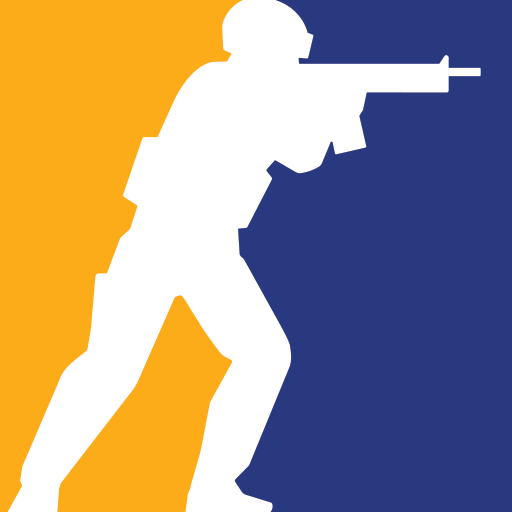

<div align="center">



# 🎴 Votação Jogo Coop — CS2 Cards

**Cartas estilo FIFA Ultimate Team para os "cyber atletas" do grupo.**  
Cada jogador tem seus atributos, time favorito e um overall calculado automaticamente.


</div>

---

## 🃏 Como funciona

Cada carta exibe:

| Campo | Descrição |
|-------|-----------|
| **Overall** | Média automática dos 6 atributos |
| **Posição** | ENT (Entrada), AWP, SUP (Suporte) |
| **Foto** | Foto do player (ou silhueta se não tiver) |
| **Nome** | Com efeito deslizante em nomes longos |
| **Atributos** | MIR · MOV · NOC · UTI · IMP · AURA |
| **Time** | Logo do time favorito do player |

**Classificação de carta por overall:**
- 🥇 **Ouro** — 80 ou mais
- 🥈 **Prata** — 60 a 79
- 🥉 **Bronze** — abaixo de 60

---

## 📁 Estrutura do projeto

```
votacaojogocoopnocs/
│
├── index.html              # Página principal com todas as cartas
│
└── assets/
    ├── cs2.png             # Logo do CS2
    │
    ├── cartas/             # Templates de fundo das cartas
    │   ├── ouro.jpg
    │   ├── prata.jpg
    │   └── bronze.jpg
    │
    ├── players/            # Fotos dos jogadores
    │   ├── negaolol.png
    │   ├── osvaldo.png
    │   └── ...             # Adicione aqui as fotos dos outros
    │
    └── times/              # Logos dos times favoritos
        ├── furia.png
        ├── navi.png
        ├── faze.png
        └── vitality.png
```

---

## ✏️ Como adicionar/editar um jogador

Abra o `index.html` e localize o array `jogadores`. Cada entrada segue esse formato:

```js
{
    nome: "Seu Apelido",
    posicao: "SUP",           // ENT, AWP ou SUP
    foto: "assets/players/suafoto.png",  // null se não tiver foto
    time: "assets/times/furia.png",
    stats: {
        mir: 80,   // Mira
        mov: 75,   // Movimentação
        noc: 70,   // Noção de jogo
        uti: 65,   // Utilidades
        imp: 72,   // Impacto
        aura: 90   // Aura 😎
    }
}
```

> Para adicionar uma foto, salve a imagem em `assets/players/` e coloque o caminho no campo `foto`.

---

## 🏆 GOAT Card

O card de destaque no topo da página é o **recorde histórico de Overall**.  
Ele fica separado do esquadrão ativo e só deve ser atualizado quando alguém superar a nota máxima já registrada.

---

## 🚀 Como rodar

Basta abrir o arquivo `index.html` no navegador. Não precisa de servidor, framework nem instalação.

```bash
# Opcionalmente, com o VS Code:
# Instale a extensão "Live Server" e clique em "Open with Live Server"
```

---

<div align="center">
  Feito com 💛 pelo grupo Votação Jogo Coop
</div>
